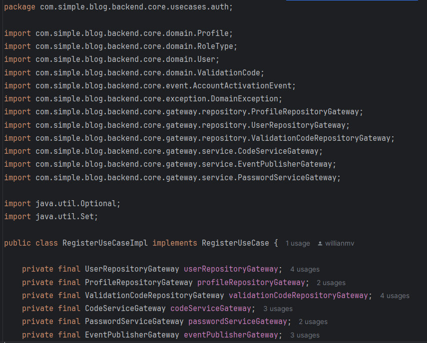

# 🏛️ Arquitetura da Aplicação

## 🧭 Visão Geral

A aplicação segue os princípios da **Clean Architecture**, proposta por **Robert C. Martin (Uncle Bob)**, com o objetivo de garantir uma **separação rigorosa** entre as **regras de negócio** e os detalhes de **implementação (como frameworks, bancos de dados, bibliotecas externas ou controladores HTTP)**.

Essa abordagem promove uma arquitetura baseada em camadas concêntricas, onde as **dependências apontam sempre para o núcleo da aplicação (o core)**, permitindo que:

- A lógica de negócio não dependa de frameworks;
- Módulos sejam facilmente substituídos;
- Os casos de uso do sistema sejam testáveis isoladamente;
- O sistema cresça de forma modular, estável e sustentável.

---

## 🧩 Organização em Camadas

### 📦 Camada Core

É o coração da aplicação. Aqui residem:

- As entidades de domínio (User, Post, Profile, etc.)
- Os casos de uso (RegisterUseCase, CreatePostUseCase, etc.)
- As interfaces de comunicação externa, chamadas de gateways

A camada ``core`` não conhece nenhuma implementação concreta – ela depende apenas de **abstrações (interfaces)**. Isso assegura que mudanças na camada externa (como trocas de banco ou framework) **não afetem a regra de negócio**.

```text
com.simple.blog.backend.core
├── domain/                 ← Entidades de negócio (ex: User, Post)
├── usecases/              ← Casos de uso organizados por contexto (auth, post, reply)
├── gateway/               ← Contratos (interfaces) que o core espera da infraestrutura
│   ├── repository/        ← Regras de acesso a dados (ex: UserRepositoryGateway)
│   └── service/           ← Serviços externos (ex: Email, PasswordEncoder)
├── event/                 ← Eventos de domínio
└── exception/             ← Exceções específicas do domínio
```
---

### 🔌 Gateways

Um dos principais mecanismos para manter essa separação são os gateways: contratos (interfaces) definidos no core, que descrevem o que precisa ser feito, mas não como.

Exemplos de gateways:

- ``UserRepositoryGateway``
- ``PasswordServiceGateway``
- ``EventPublisherGateway``

Essas interfaces são implementadas na camada de infra ou adapters, que injeta as implementações reais no momento da execução (via injeção de dependência, por exemplo).

---

### 🏗️ Camada Infraestrutura

Responsável por:

- Implementar os gateways com ferramentas reais (ex: Spring Data JPA, JWT, SMTP)
- Conectar o mundo externo ao sistema (HTTP controllers, banco, mensageria, filas, etc.)

**O ``infra`` conhece o ``core``, mas nunca o contrário.**

```text
com.simple.blog.backend.infra
├── config/                ← Configurações (injeção de dependência, segurança, auditoria)
│   └── usecase/           ← Criação e injeção dos casos de uso com suas dependências
├── controller/            ← Camada de entrada (HTTP REST)
├── dto/                   ← Objetos de entrada e saída (request/response)
├── gateway/               ← Implementações dos gateways
│   ├── repository/        ← Adaptações do repositório para o core
│   └── service/           ← Serviços externos concretos (ex: Email, Encoder)
├── handler/               ← Tratamento de exceções e erros
├── mapper/                ← Conversão entre entidades do core e da persistência
└── persistence/           
    ├── entity/            ← Entidades JPA / ORM (banco de dados)
    └── repository/        ← Repositórios Spring Data / JPA
```
---

### 🛠️ Exemplo Prático: ``RegisterUseCase``



Esse caso de uso:

- Orquestra o processo de registro de um novo usuário, verificando duplicações, codificando a senha, associando perfis, criando códigos de ativação e disparando eventos.
- Utiliza apenas interfaces definidas no core (``UserRepositoryGateway``, ``PasswordServiceGateway``, ``EventPublisherGateway``, etc.).
- **Não conhece nenhuma dependência** externa como Spring, JPA, ou banco de dados específico.
- Pode ser **testado com mocks** sem necessidade de banco ou framework.

Esse exemplo demonstra que **mesmo usando o ecossistema Spring**, o **núcleo permanece totalmente desacoplado** da infraestrutura, respeitando o princípio da **Inversão de Dependência**.


---
### 🔁 Como se conectam

- O core define uma interface no pacote gateway (ex: ``UserRepositoryGateway``)
- A infra implementa essa interface no pacote ``infra.gateway.repository`` (ex: ``UserRepositoryImpl``)
- Os controllers chamam os casos de uso do core, e o core executa a lógica sem saber quem está por trás dos serviços ou bancos

---

### ✅ Resultado

- O core permanece puro e desacoplado
- A infra pode ser modificada (ex: trocar JPA por MongoDB, ou SMTP por outro serviço de e-mail) sem alterar o core
- A arquitetura é modular, testável e preparada para evoluções


