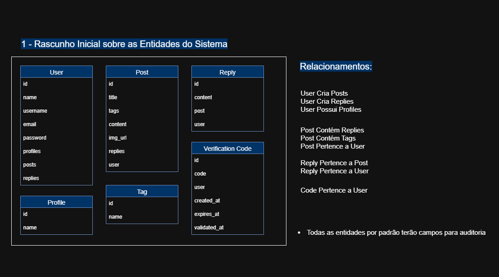
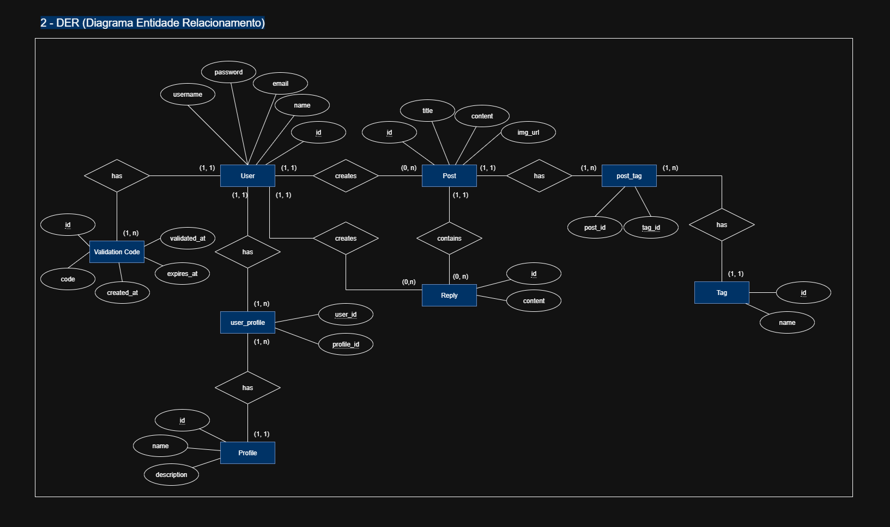
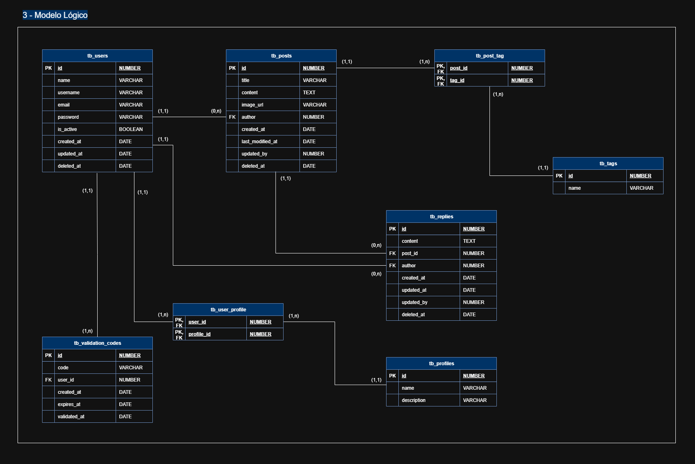
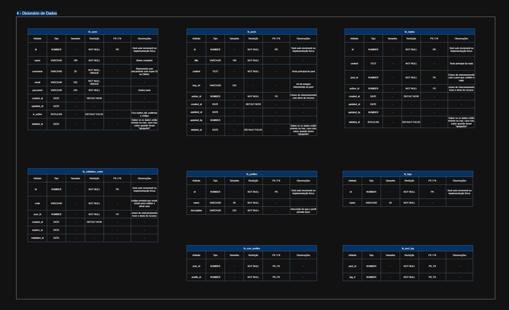

# 🧠 Visão Geral da Modelagem

Este sistema foi projetado para representar uma plataforma de blog com suporte a múltiplos usuários, onde é possível criar publicações (posts), responder a elas (replies), além de possuir controle de autenticação e autorização por meio de perfis e códigos de verificação.

### A modelagem de dados foi dividida em quatro níveis:

- Modelo Conceitual: visão inicial das entidades e seus relacionamentos.
- DER (Diagrama Entidade-Relacionamento): representação visual das entidades, atributos e como se relacionam.
- Modelo Lógico: estrutura tabular com tipos de dados e chaves primárias/estrangeiras.
- Dicionário de Dados: especificações detalhadas de cada atributo.

---

## 📘 Modelo Conceitual

> Objetivo: Representar de forma simplificada as entidades principais do sistema e seus relacionamentos essenciais.

Este modelo é o primeiro rascunho da estrutura de dados do sistema de blog. Ele apresenta, de maneira geral, as entidades fundamentais como usuários, posts, respostas, perfis, tags e códigos de verificação, juntamente com seus atributos básicos e as conexões entre elas.

Essa visão ajuda a compreender o que o sistema deve armazenar e como os elementos interagem entre si antes da criação de estruturas técnicas mais detalhadas.

### Entidades principais:

``User``, ``Post``, ``Reply``, ``Profile``, ``Tag``,``VerificationCode``

### Relacionamentos destacados:

- Usuários criam posts e respostas
- Posts possuem tags e respostas
- Replies pertencem a posts e usuários
- Códigos de verificação pertencem a usuários
- Usuários possuem perfis (autorização)

> 🔍 Nota: Todas as entidades terão campos de auditoria como created_at, updated_at, etc., por padrão.

---

## 🔗 DER — Diagrama Entidade-Relacionamento

> Objetivo: Representar visualmente as entidades, atributos e relacionamentos com cardinalidades explícitas.

O DER detalha as estruturas identificadas no modelo conceitual, especificando os atributos de cada entidade e os tipos de relacionamento entre elas, como 1:1, 1:N ou N:N.

Também são incluídas as tabelas intermediárias para representar relacionamentos muitos-para-muitos, como:

- ``user_profile`` -- entre users e profiles
- ``post_tag`` -- entre posts e tags

---

## 🧱 Modelo Lógico — Estrutura de Banco Relacional

> Objetivo: Traduzir o DER para uma estrutura relacional com chaves primárias, estrangeiras e tipos de dados.

Nesta etapa, o modelo é adaptado para implementação em um banco de dados relacional. Cada entidade se torna uma tabela e todos os relacionamentos são formalizados por meio de chaves estrangeiras (FKs).

### São definidos:

- Tipos de dados (VARCHAR, NUMBER, BOOLEAN, TEXT, DATE)
- Campos obrigatórios e restrições (NOT NULL, DEFAULT)
- Estrutura das tabelas de junção para relacionamentos N:N

Esse modelo serve como base direta para geração do schema SQL do banco.

---

## 📚 Dicionário de Dados — Definição Técnica dos Campos

> Objetivo: Documentar tecnicamente todos os atributos do banco com seus tipos, restrições e observações.

O dicionário de dados traz uma visão completa de todos os campos das tabelas do banco de dados.

### Para cada atributo, são definidos:

- Nome
- Tipo de dado
- Tamanho (quando aplicável)
- Restrições (PK, FK, NOT NULL, etc.)
- Observações específicas (valores default, chaves compostas, validações)

Com esse nível de detalhe, a documentação garante que todos os envolvidos (desenvolvedores, DBAs, analistas) compreendam o uso correto e completo de cada campo no banco de dados.

---

## ✅ Concluindo:

### A partir deste ponto, o time de backend já pode:

- Criar as migrations para o banco de dados;
- Implementar os repositórios e modelos de domínio;
- Estruturar os serviços de autenticação e autorização com base nos perfis definidos;
- Desenvolver os endpoints REST/GraphQL de forma consistente com o modelo validado.

> ⚙️ A modelagem aqui apresentada serve como contrato de dados entre todas as camadas da aplicação e pode ser expandida no futuro conforme surgirem novas funcionalidades.